<div align="center">

# 🔍 Visual Comparison

### Scalable visual regression testing with Playwright + TypeScript

[](https://github.com/IvanPetrovic991/visual-comparison/actions/workflows/visual-tests.yml)
[](https://playwright.dev/)
[](https://www.typescriptlang.org/)
[](https://nodejs.org/)
[](LICENSE)
[](https://ivanpetrovic.dev/visual-comparison/)

Pixel-perfect UI regression testing that **catches the layout and styling breakage functional tests walk straight past** — and proves it by diffing a clean build against an intentionally broken one. Built to scale to **1000+ snapshots** with a data-driven registry, custom fixtures, tagging and sharded CI.

</div>

---

## ✨ What it does

This suite captures pixel **baselines** of a web app's UI, then fails the build whenever those pixels change unexpectedly. The target is the [**Practice Software Testing — Toolshop**](https://practicesoftwaretesting.com), a modern e-commerce app purpose-built for test-automation practice.

<div align="center">
<table>
  <tr>
    <td align="center">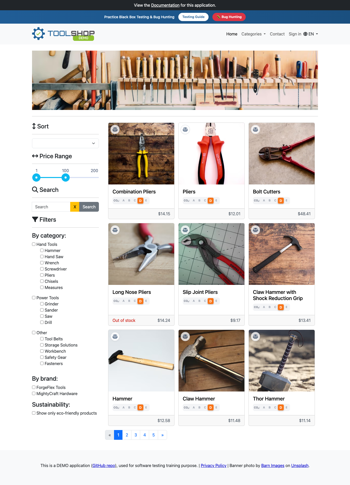<br/><sub><b>Home — product grid</b></sub></td>
    <td align="center">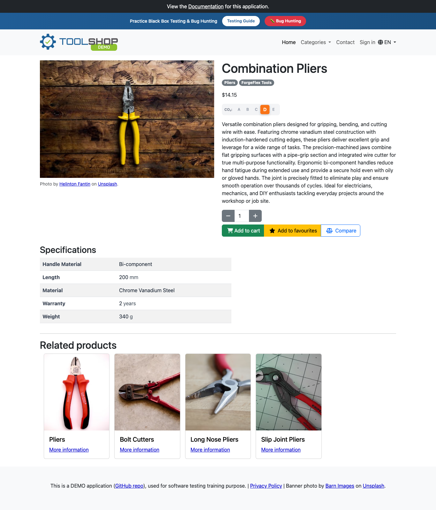<br/><sub><b>Product detail</b></sub></td>
  </tr>
  <tr>
    <td align="center">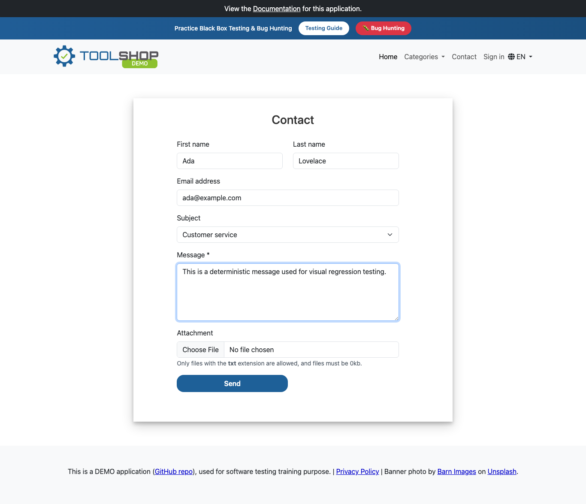<br/><sub><b>Contact form</b></sub></td>
    <td align="center">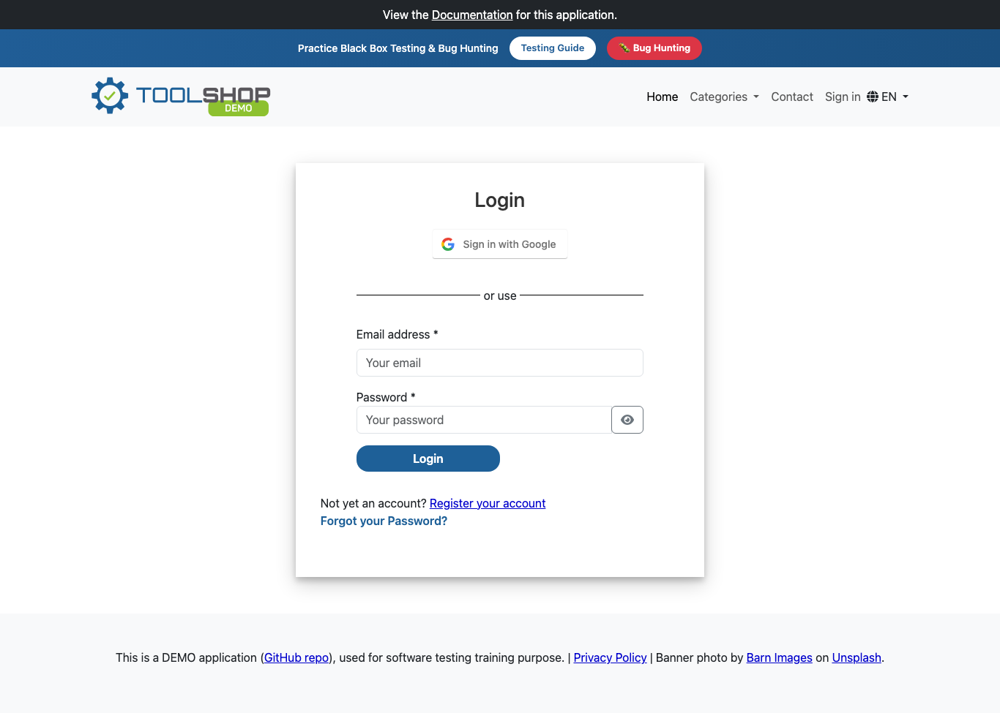<br/><sub><b>Sign in</b></sub></td>
  </tr>
</table>
</div>

---

## 🎯 The idea: prove it catches real bugs

A screenshot test is only convincing if it catches something. The Toolshop ships in two flavours backed by **identical data** — so any pixel difference between them is a genuine UI regression:

| Build | URL | Role |
| --- | --- | --- |
| **Clean** | `practicesoftwaretesting.com` | Source of truth — baselines are recorded here |
| **With bugs** | `with-bugs.practicesoftwaretesting.com` | Injected UI defects — the *same* tests run here |

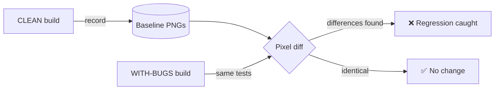

Run the suite against the clean build and everything is green. Point it at the with-bugs build and **every page lights up red** — the suite caught the regressions:

<div align="center">
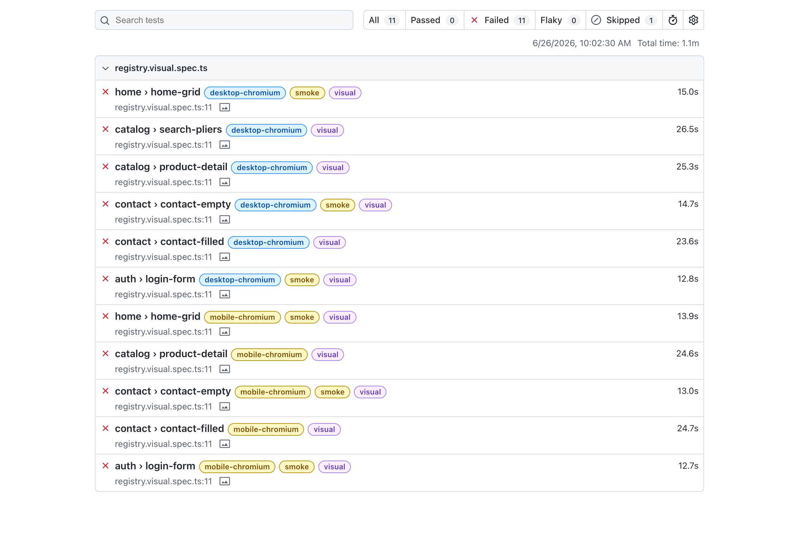
<br/><sub>Playwright HTML report running against the <b>with-bugs</b> build — 11 failures caught, grouped by feature, tagged <code>@smoke</code> / <code>@visual</code>.</sub>
</div>

### A caught regression, up close

The with-bugs build introduces a shifted layout plus typos like **`Contakt`** (nav) and **`Massage`** (Message). Baseline vs. actual vs. computed diff:

<div align="center">
<table>
  <tr>
    <td align="center">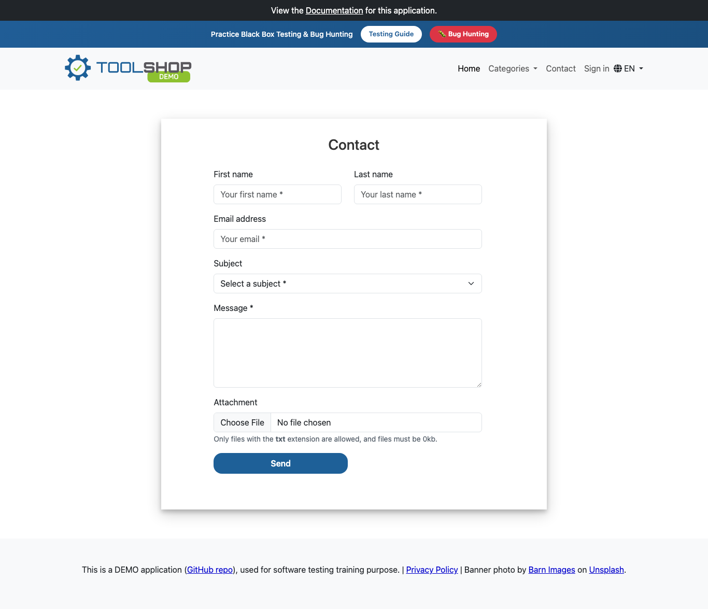<br/><sub><b>Expected</b> (clean baseline)</sub></td>
    <td align="center">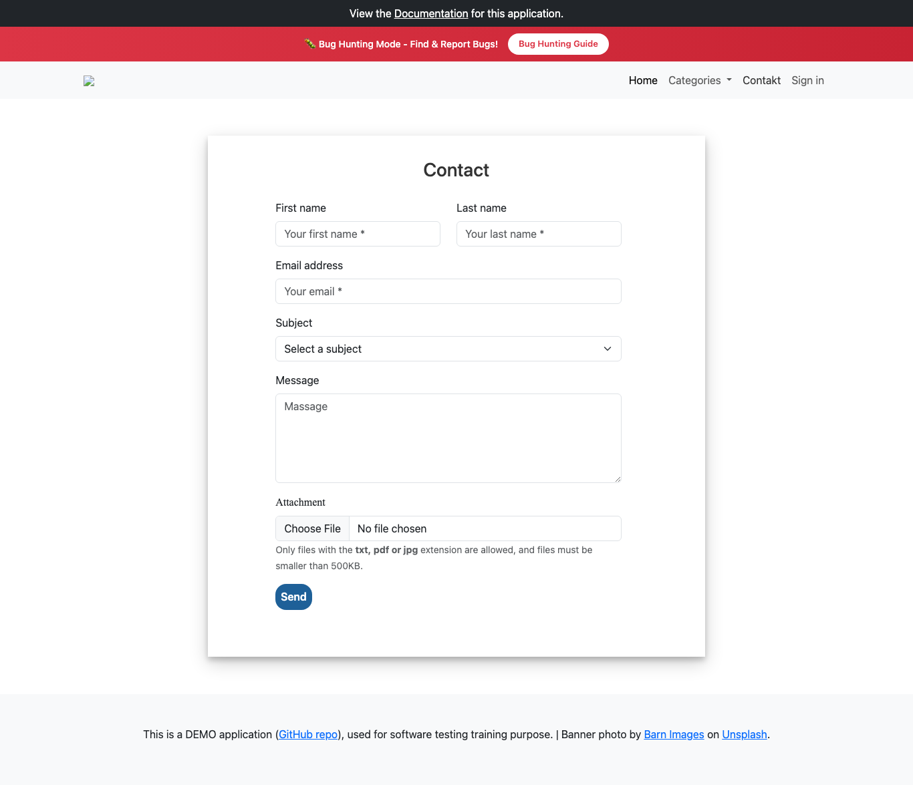<br/><sub><b>Actual</b> (with-bugs build)</sub></td>
    <td align="center">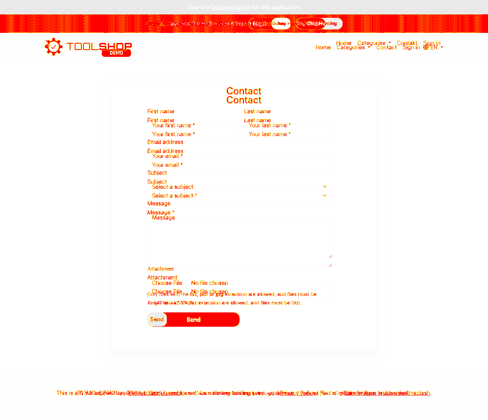<br/><sub><b>Diff</b> (changed pixels)</sub></td>
  </tr>
</table>
</div>

Every failure ships with the full diff, the stabilization call-log, and the source line — straight from the merged HTML report:

<div align="center">
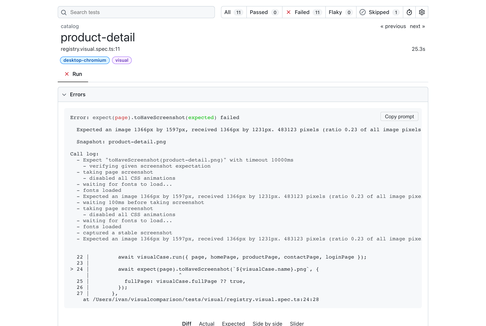
</div>

---

## 📊 Two reports, two purposes

| Report | Best for | Where |
| --- | --- | --- |
| **Playwright HTML** (native) | the **visual diffs** — Expected / Actual / Diff slider per failure | `playwright-report` CI artifact, merged from every shard |
| **Allure dashboard** | the **caught regressions** — image-diff slider + failure reason, plus history & trends | 🔗 **[live on GitHub Pages](https://ivanpetrovic.dev/visual-comparison/)** |

Both report on the **with-bugs run**, so the failures are real. The native Playwright report stays primary for its per-failure diff slider, while **Allure** runs as a *secondary* reporter — a hosted dashboard where every failed test carries its **interactive image diff (Expected / Actual / Diff)** and the exact reason it failed, with history & trends across runs.

<div align="center">
<a href="https://ivanpetrovic.dev/visual-comparison/">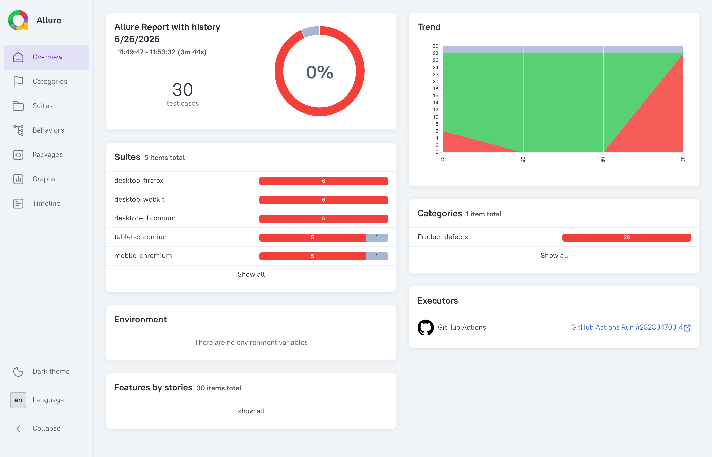</a>
<br/><sub>The live <b><a href="https://ivanpetrovic.dev/visual-comparison/">Allure dashboard</a></b> — pass-rate, history trend, and per-project breakdown, regenerated by CI on every run.</sub>
</div>

---

## 🧰 Tech stack

- **[Playwright Test](https://playwright.dev/)** `1.61` — built-in `toHaveScreenshot()` pixel comparison, **no external SaaS** (Percy/Applitools not required).
- **TypeScript** `6.0` — a fully typed Page Object Model + fixtures.
- **Cross-browser & responsive** — Chromium, Firefox, WebKit on desktop, plus tablet and mobile viewports.
- **Docker** — the official Playwright image guarantees identical rendering locally and in CI.
- **GitHub Actions** — sharded matrix + blob reporter + `merge-reports` for one combined HTML report.
- **[Allure](https://allurereport.org/)** — a secondary reporter feeding a hosted [trends dashboard](https://ivanpetrovic.dev/visual-comparison/) (history, flakiness) published to GitHub Pages.

---

## 🚀 Built to scale to 1000+ tests

Everything here is designed so that growing from 6 scenarios to 1000+ is **linear effort, not exponential**.

### 1. Data-driven registry — add a row, get a test

Visual coverage lives in one array ([`pageRegistry.ts`](tests/support/pageRegistry.ts)). A single generated spec ([`registry.visual.spec.ts`](tests/visual/registry.visual.spec.ts)) turns each entry into a test, multiplied across every project. **Adding a screenshot is one object, not a new file:**

```ts
// tests/support/pageRegistry.ts
export const visualCases: VisualCase[] = [
  {
    category: 'home',
    name: 'home-grid',
    tags: ['@smoke', '@visual'],
    run: async ({ homePage }) => { await homePage.open(); },
  },
  // ... add 1000 more entries here — no new test code.
  // Data can also be loaded from JSON/CSV at module-load to scale dynamically.
];
```

### 2. Fixtures kill boilerplate

Page objects arrive **pre-instantiated** via [`test.extend`](tests/support/fixtures.ts) — no `new HomePage(page)` repeated across a thousand tests, and fixtures are lazy (built only when a test uses them).

### 3. Tags for selective runs

Every case is tagged, so CI can run a fast smoke gate before the full suite:

```bash
npm run test:smoke      # only @smoke  (fast pre-merge gate)
npm run test:visual     # only @visual
```

### 4. Sharded CI with a single merged report

The workflow splits the suite across a **matrix of shards** (one runner each), each emitting a `blob` report; a final job merges them into one HTML report with all the diffs.

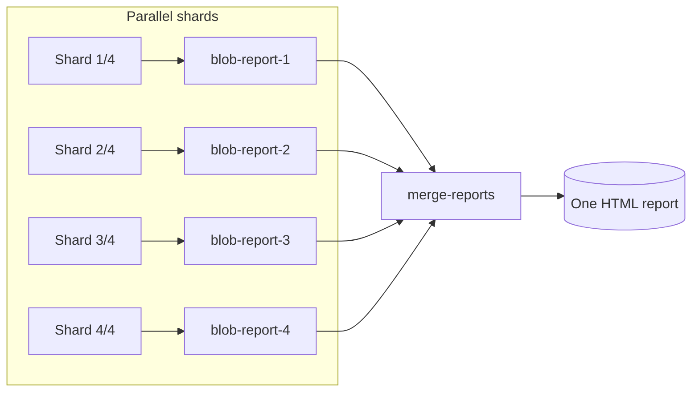

Bump `shardTotal` in [`visual-tests.yml`](.github/workflows/visual-tests.yml) as the suite grows — `fullyParallel: true` keeps shards evenly balanced at the individual-test level.

### 5. Other scale-minded choices

| Concern | Approach |
| --- | --- |
| **Flake** | Central `expect.toHaveScreenshot` defaults + a shared [`stylePath`](tests/support/visual-stabilize.css) stylesheet that freezes animations & hides the chat widget for the whole suite |
| **Selectors** | `testIdAttribute: 'data-test'` → clean `getByTestId('product-name')`, immune to CSS/text refactors |
| **Baseline churn** | `updateSnapshots: 'none'` in CI (fails on drift); update intentionally with `npm run baseline:changed` (rewrites only what differs) |
| **Determinism** | `scale: 'css'`, pinned `locale`/`timezone`/`colorScheme`, and the pinned Playwright Docker image |
| **Baseline volume** | At thousands of PNGs, move `*.png` under the snapshot dir into **Git LFS** (`*.png filter=lfs diff=lfs merge=lfs`) to keep clones fast |

---

## 📁 Project structure

```
visual-comparison/
├── tests/
│   ├── visual/
│   │   ├── registry.visual.spec.ts     # generated tests (one per registry entry)
│   │   └── __screenshots__/            # committed baseline PNGs (per project/platform)
│   └── support/
│       ├── fixtures.ts                  # test.extend — injects page objects
│       ├── pageRegistry.ts              # ⭐ the single source of visual coverage
│       ├── stabilize.ts                 # runtime stabilization (fonts, lazy images, overlays)
│       ├── visual-stabilize.css         # stylePath — freezes animations, hides chat widget
│       └── pages/                       # Page Object Model
│           ├── BasePage.ts
│           ├── HomePage.ts
│           ├── ProductDetailPage.ts
│           ├── ContactPage.ts
│           └── LoginPage.ts
├── .github/workflows/visual-tests.yml   # sharded CI: clean baseline → with-bugs demo → merge
├── Dockerfile · docker-compose.yml      # deterministic rendering
├── playwright.config.ts
└── tsconfig.json
```

---

## ⚡ Quick start

> Requires **Node ≥ 20**.

```bash
# 1. Install dependencies + browsers
npm install
npx playwright install --with-deps

# 2. Record baselines from the CLEAN build (first run only)
npm run baseline

# 3. Re-run against the clean build — everything should pass
npm test

# 4. Run against the WITH-BUGS build — the suite should now FAIL on the diffs 🎉
npm run test:bugs

# 5. Open the visual report with side-by-side baseline / actual / diff
npm run report
```

### Recommended: run in Docker for deterministic pixels

Fonts and anti-aliasing differ between macOS, Windows and Linux, so a baseline recorded on your Mac won't match one recorded in CI (Linux). For **identical** rendering everywhere, run inside the official Playwright container:

```bash
npm run docker:baseline   # record Linux baselines (match CI exactly)
npm run docker:test       # verify against the clean build
npm run docker:bugs       # catch the regressions in the with-bugs build
```

---

## 📜 Commands

| Command | What it does |
| --- | --- |
| `npm test` | Run all visual tests against `BASE_URL` (default: clean build) |
| `npm run test:bugs` | Run against the **with-bugs** build — expected to fail on real diffs |
| `npm run test:smoke` | Run only `@smoke`-tagged tests (fast gate) |
| `npm run test:visual` | Run only `@visual`-tagged tests |
| `npm run baseline` | (Re)record **all** baselines — after an intentional UI change |
| `npm run baseline:changed` | Rewrite **only** the baselines that differ (clean git diffs) |
| `npm run test:ci` | Chromium desktop + mobile only (fast subset) |
| `npm run report` | Open the HTML report with diff images |
| `npm run merge-report` | Merge sharded `blob` reports into one HTML report |
| `npm run allure` | Generate & open the Allure report locally (needs a Java runtime) |
| `npm run typecheck` | Type-check the suite with `tsc` |
| `npm run docker:*` | The same flows inside the pinned Playwright Docker image |

Point the suite anywhere with an env var:

```bash
BASE_URL=https://with-bugs.practicesoftwaretesting.com npm test
```

---

## 🧪 How a deterministic snapshot is made

Visual tests are only useful if they're stable. Flake is removed in layers:

- **Animations, transitions, smooth-scroll and caret** — frozen via the shared [`visual-stabilize.css`](tests/support/visual-stabilize.css) injected by Playwright at capture time (`stylePath`), plus the matcher's `animations: 'disabled'`.
- **The live-chat widget** — hidden by that same stylesheet (it polls forever and animates in a cross-origin iframe).
- **Web fonts** — awaited via `document.fonts.ready` so no glyph swaps mid-shot.
- **Lazy-loaded images** — scrolled into view and waited on until decoded.
- **DPI / locale** — `scale: 'css'` and pinned `locale` / `timezone` / `colorScheme` keep rendering identical across machines.
- **Tolerance** — a small `maxDiffPixelRatio` + `threshold` absorbs sub-pixel anti-aliasing noise without hiding genuine changes.

Routing note: the with-bugs deployment uses **hash routing** and 404s on deep links, so pages like Contact/Sign-in are reached by **clicking through the app's own navigation** (which also opens the hamburger menu on mobile) — this works on every deployment and exercises the real client-side router.

---

## 🤖 CI pipeline

[`.github/workflows/visual-tests.yml`](.github/workflows/visual-tests.yml) runs on every push and PR, inside the pinned Playwright container:

1. **Shard** the suite across a 4-way matrix (one runner each).
2. Each shard **records** baselines from the clean build, **sanity-checks** the clean build against them (no false positives), then **compares** the with-bugs build and **asserts** the diffs were caught.
3. Each shard uploads a `blob` report and its **Allure results** — both from the with-bugs run, so the failures and image diffs show up in both reports.
4. A **merge** job stitches the blobs into one native HTML report (with all diffs); an **Allure** job builds the dashboard with history and publishes it to GitHub Pages.

📊 **Live Allure dashboard:** **https://ivanpetrovic.dev/visual-comparison/**

Download the `playwright-report` artifact from any run to browse the caught regressions visually.

---

## ➕ Adding a new visual test

```ts
// tests/support/pageRegistry.ts — append one entry:
{
  category: 'checkout',
  name: 'cart-summary',
  tags: ['@visual'],
  run: async ({ homePage, page }) => {
    await homePage.open();
    await homePage.openFirstProduct();
    await page.getByTestId('add-to-cart').click();
    await page.getByTestId('nav-cart').click();
  },
},
```

Then `npm run baseline` to record it. That single object becomes a test across **all five** browser/viewport projects.

---

## 📝 Notes

- Selectors target the Toolshop's `data-test` attributes; if the app changes them, update the relevant page object.
- The clean / with-bugs sites are third-party demos — this project tests them but is not affiliated with them.
- Committed baselines in this repo are macOS (`darwin`); CI regenerates Linux baselines in-container each run, so the two never conflict. Use the Docker scripts for local/CI parity.

## License

[MIT](LICENSE)
