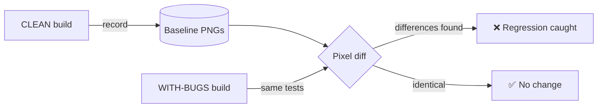

# 🔍 Visual Comparison — Playwright Visual Regression Suite

[](https://github.com/IvanPetrovic991/visual-comparison/actions/workflows/visual-tests.yml)
[](https://playwright.dev/)
[](https://www.typescriptlang.org/)
[](https://nodejs.org/)

An end-to-end **visual regression testing** suite built with **Playwright + TypeScript**. It captures pixel baselines of a web app's UI and fails the build when those pixels change unexpectedly — the kind of layout/styling breakage that functional tests happily walk straight past.

The twist that makes this more than a screenshot demo: it proves it catches real bugs by diffing a **clean build** against an **intentionally broken build** of the same app.

---

## 🎯 The idea

The target is the [**Practice Software Testing — Toolshop**](https://practicesoftwaretesting.com), a modern e-commerce app purpose-built for test-automation practice. It is published in two flavours backed by the same data:

| Build | URL | Role |
| --- | --- | --- |
| **Clean** | `practicesoftwaretesting.com` | Source of truth — we record baselines here |
| **With bugs** | `with-bugs.practicesoftwaretesting.com` | Contains injected UI defects — we run the *same* tests here |



Because both builds serve identical catalog data, **any** pixel difference is a genuine UI regression — exactly what a visual suite should flag. The CI pipeline records baselines against the clean build, confirms the clean build matches them (no false positives), then runs against the buggy build and asserts that the diffs were caught.

---

## 🧰 Tech stack

- **[Playwright Test](https://playwright.dev/)** `1.61` — `expect(page).toHaveScreenshot()` for built-in pixel comparison, no external SaaS.
- **TypeScript** `6.0` — fully typed Page Object Model.
- **Cross-browser & responsive** — Chromium, Firefox, WebKit + tablet and mobile viewports.
- **Docker** — the official Playwright image guarantees identical rendering locally and in CI.
- **GitHub Actions** — runs the full clean→buggy comparison on every push/PR and uploads the visual diff report.

---

## 📁 Project structure

```
visual-comparison/
├── tests/
│   ├── visual/                  # the specs — one assertion = one snapshot
│   │   ├── home.spec.ts
│   │   ├── search.spec.ts
│   │   ├── product-detail.spec.ts
│   │   ├── contact.spec.ts
│   │   ├── login.spec.ts
│   │   └── __screenshots__/      # committed baseline PNGs (per spec/project/platform)
│   └── support/
│       ├── stabilize.ts          # makes pages pixel-deterministic before a snapshot
│       └── pages/                # Page Object Model
│           ├── BasePage.ts
│           ├── HomePage.ts
│           ├── ProductDetailPage.ts
│           ├── ContactPage.ts
│           └── LoginPage.ts
├── .github/workflows/visual-tests.yml
├── Dockerfile
├── docker-compose.yml
├── playwright.config.ts
└── tsconfig.json
```

---

## 🚀 Quick start

> Requires **Node ≥ 20**.

```bash
# 1. Install dependencies + browsers
npm install
npx playwright install --with-deps

# 2. Record the baselines from the CLEAN build (first run only)
npm run baseline

# 3. Re-run against the clean build — everything should pass
npm test

# 4. Run against the WITH-BUGS build — the suite should now FAIL on the diffs 🎉
npm run test:bugs

# 5. Open the visual report with side-by-side baseline / actual / diff
npm run report
```

### Recommended: run in Docker for deterministic pixels

Fonts and anti-aliasing differ between macOS, Windows and Linux, so a baseline recorded on your Mac won't match one recorded in CI (Linux). To get **identical** rendering everywhere, run inside the official Playwright container — the committed baselines are Linux baselines produced this way:

```bash
npm run docker:baseline   # record Linux baselines (match CI exactly)
npm run docker:test       # verify against the clean build
npm run docker:bugs       # catch the regressions in the with-bugs build
```

---

## 📜 Commands

| Command | What it does |
| --- | --- |
| `npm test` | Run all visual tests against `BASE_URL` (default: clean build) |
| `npm run test:bugs` | Run against the **with-bugs** build — expected to fail on real diffs |
| `npm run baseline` | (Re)record baseline snapshots — run after an intentional UI change |
| `npm run test:ci` | Chromium desktop + mobile only (fast, used by CI) |
| `npm run report` | Open the HTML report with diff images |
| `npm run typecheck` | Type-check the suite with `tsc` |
| `npm run docker:*` | The same flows inside the Playwright Docker image |

Point the suite anywhere with an env var:

```bash
BASE_URL=https://with-bugs.practicesoftwaretesting.com npm test
```

---

## 🧪 How a deterministic snapshot is made

Visual tests are only useful if they're stable. Before every screenshot, [`stabilize()`](tests/support/stabilize.ts) and the Playwright config remove the usual sources of flake:

- **Animations & transitions** disabled (`animations: 'disabled'` + a CSS override).
- **Web fonts** awaited via `document.fonts.ready` (no swap-in mid-shot).
- **Lazy-loaded images** scrolled into view and waited on until decoded.
- **Caret** hidden, **network** settled, **locale/timezone/color-scheme** pinned.
- A small **anti-aliasing tolerance** (`threshold`, `maxDiffPixelRatio`) absorbs sub-pixel noise without hiding genuine changes.

Snapshots are keyed by spec, project and platform — e.g.
`tests/visual/__screenshots__/home.spec.ts/home-grid-desktop-chromium-linux.png`.

---

## 🤖 CI

[`.github/workflows/visual-tests.yml`](.github/workflows/visual-tests.yml) runs on every push and PR:

1. **Record** baselines from the clean build.
2. **Sanity-check** the clean build against its own baselines → must pass (no false positives).
3. **Compare** the with-bugs build against those baselines → diffs expected.
4. **Assert** the diffs were caught, and **upload** the Playwright report (with side-by-side diff images) as a build artifact.

Download the `playwright-report` artifact from any run to browse the caught regressions visually.

---

## 🔧 Extending

- Add a new page object under `tests/support/pages/` and a matching `*.spec.ts`.
- Mask dynamic regions per-assertion: `toHaveScreenshot({ mask: [page.locator('.promo-banner')] })`.
- Snapshot a single component instead of the full page: `expect(locator).toHaveScreenshot()`.
- Tune sensitivity globally in [`playwright.config.ts`](playwright.config.ts) (`threshold`, `maxDiffPixelRatio`).

---

## 📝 Notes

- Selectors target the Toolshop's `data-test` attributes; if the app changes them, update the relevant page object.
- The clean/with-bugs sites are third-party demos — this project tests them but is not affiliated with them.

## License

MIT
